# Rent or Buy Property: A Console Application
This repository showcases a beginner-friendly C# console application designed to assist users in deciding whether renting or buying a property is more affordable.

## Overview
This C# command-line application helps users determine if their current expenses are sufficient to rent or buy a property. By inputting their gross monthly income, tax deductions, and other monthly expenses, users can calculate their housing affordability. The application calculates the monthly loan repayment for buying a property and alerts users if the repayment is more than a third of their gross monthly income, indicating a lower likelihood of loan approval. Additionally, it provides an overview of available funds after deductions.

The code follows internationally accepted coding standards, with comprehensive comments explaining variables, methods, and programming logic.

## Table of Contents
- [Rent or Buy Property](#rent-or-buy-property-a-console-application)
- [Overview](#overview)
- [Table of Contents](#table-of-contents)
- [Features](#features)
- [Demonstrating functionality](#demonstrating-functionality)
- [Error Handling](#error-handling)
- [Code Walkthrough](#code-walkthrough)

## Features
- Income and Expense Calculation: Users can input their gross monthly income, tax deductions, and other monthly expenses for a customized affordability assessment.
- Rent or Buy Options: Users can select to either rent or buy a property. For renting, they enter the monthly rental amount; for buying, they enter the purchase price, deposit, interest rate, and loan term.
- Affordability Alerts: The application notifies users if their calculated loan repayment exceeds one-third of their income, indicating potential challenges with loan approval.
- Input Validation: The application checks for valid inputs, including numbers only for income and expense fields, and prompts users to re-enter data as needed.

## Demonstrating functionality
Here’s a step-by-step demonstration of the application's functionality:

1. Gross Monthly Income Input:
* The user is prompted to enter their gross monthly income:
  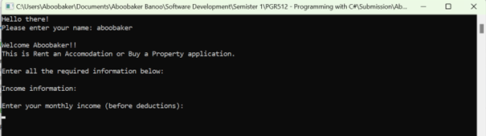

2. Estimated Monthly Tax Deduction Input:
* The user is prompted to enter their estimated monthly tax deduction:
  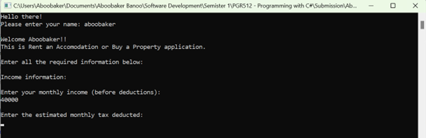

3. Monthly Living Expenses Input:
* Users provide an estimate of their total monthly living expenses:
  a. Living expenses:
  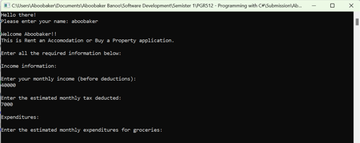
  b. Additional expenses:
  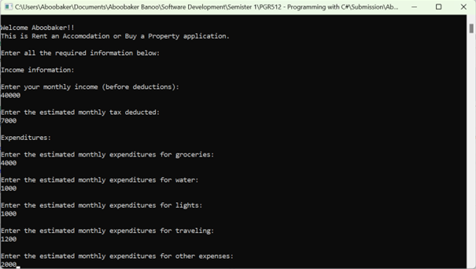

4. Rent or Buy Selection:
* The user selects either the renting or buying option:
  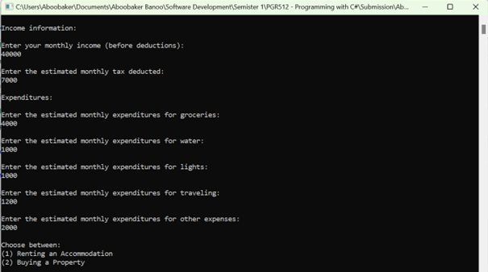

5. Renting Option:
* If renting is selected, the user inputs the monthly rental amount:
  

6. Buying Option:
* If buying is selected, the user provides the property’s purchase price: 
  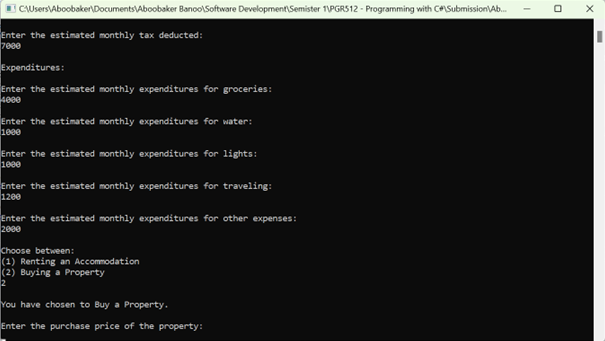

* Deposit amount:
  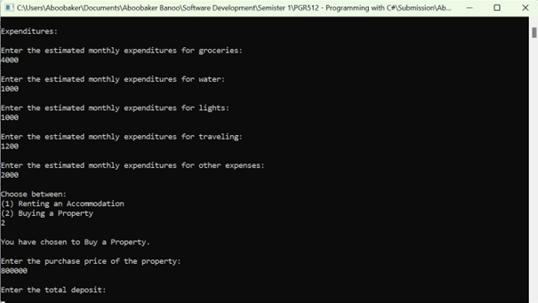

* Interest rate:
  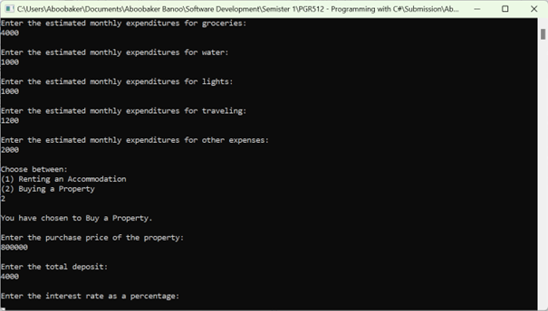

* And loan term in months:
  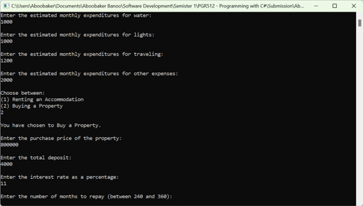

7. Affordability Calculation and Results:
* For both renting and buying options, the application calculates the available monthly funds after expenses and, if applicable, the monthly home loan repayment:
  Calculate available monthly funds (if renting):
  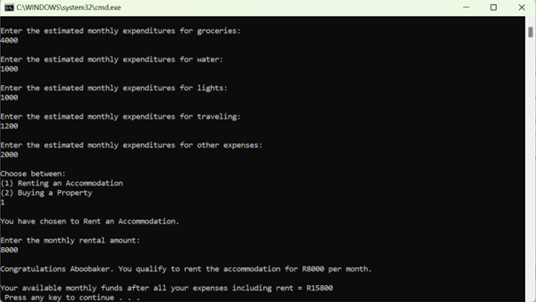
  Calculate available monthly funds (if buying):
  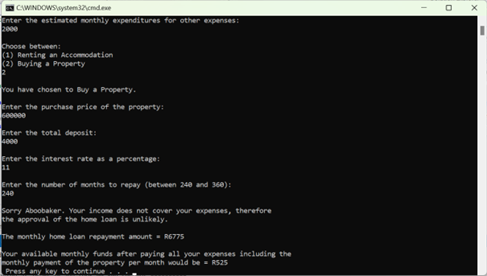
  Calculate monthly home loan repayment amount (if applicable):
  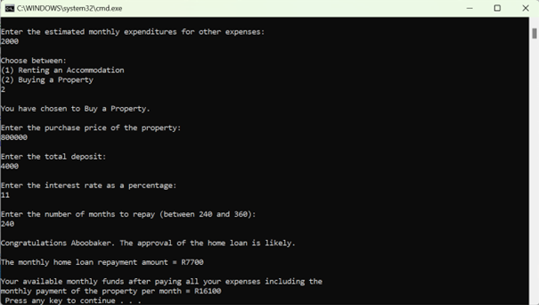

* It then displays an alert if the repayment amount exceeds one-third of the user's income:
  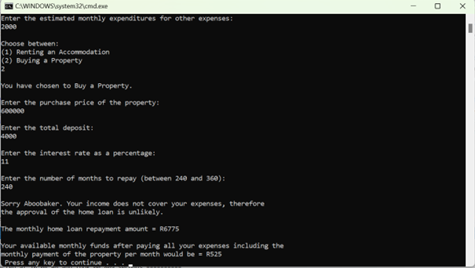

## Error Handling: 
The application incorporates robust error handling to ensure valid input from the user. Below are a few examples:

1. Name Input Validation:
* If the user fails to enter a name, they’ll be prompted to re-enter it. If they enter their name in lowercase, it’s automatically capitalized:
  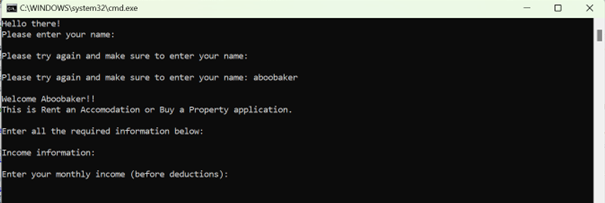

2. Negative and Textual Inputs:
* If the user enters negative numbers or text in fields expecting numerical input, they are prompted to re-enter valid data:
  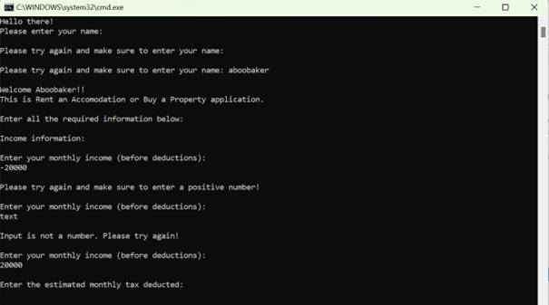

3. Rent or Buy Selection Validation:
* For the rent/buy selection, if the user enters a number other than 1 or 2, a negative number, or text, they are prompted to re-enter a valid selection:
  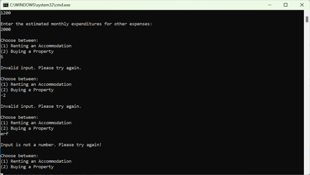

## Code Walkthrough
This section explains the main functions and logic implemented in the application:

- Income and Expense Handling: Handles user input for income and expenses, ensuring they are numeric and positive.
- Loan Calculation: Calculates monthly repayments based on user inputs for property price, deposit, interest rate, and term.
- Affordability Check: Compares repayment amount to one-third of gross monthly income, displaying an alert if the threshold is exceeded.
