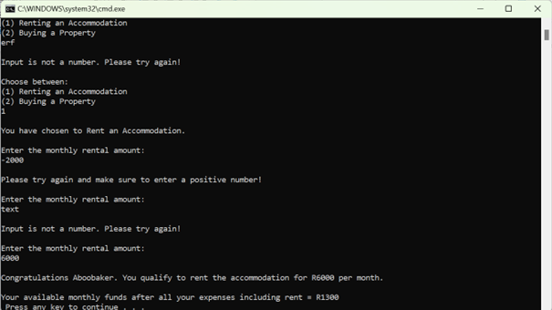

# Rent Or Buy Property Console-Line Application
This repository showcases a beginner C# console applications for renting or buying a property.

## Context
The Rent or Buy Property is a C# command-line application that aims to assist family members determine if the amount of money they are paying is sufficient to purchase a house.

## Table of Contents
- [Rent or Buy Property](#rent-or-buy-property-console-line-application)
- [Context](#context)
- [Table of Contents](#table-of-contents)

## Overview
Rent or Buy Property Application 

You requested assistance in using an application to help a family member determine if the amount of money they are paying is sufficient to purchase a house. The family member will use the application to input their gross monthly income (before deductions), estimated monthly tax deducted, and estimated monthly expenditures in various categories. Then they can choose between renting accommodation or buying a property. If they choose to rent, they can input the monthly rental amount. If they choose to buy a property, they must enter the purchase price, total deposit, interest rate, and number of months to repay. The Application will calculate the monthly home 
loan repayment for buying a property and alert the user if the repayment amount is more than a third of their gross monthly income, indicating that approval of the home loan is unlikely. The Application will also calculate the available monthly money after all specified deductions.
- The coding standards should be internationally acceptable, and the code should include comprehensive 
comments explaining variable names, methods, and the logic of programming code.  
- Submit source code and a readme file with instructions for compiling and running the software:

### Demonstrating functionality

Prompt user for gross monthly income:
  

Prompt user for estimated monthly tax deduction:
  

Prompt user for estimated monthly living expenses:
  a.
  

  b.
  

Prompt user to choose between renting or buying:
  

Prompt user for monthly rental amount (if renting):
  

Prompt user for purchase price (if buying):
  

Prompt user for total deposit amount (if buying):
  

Prompt user for interest rate (if buying): 
  

Prompt user for number of months for repayment (if buying):
  

Calculate available monthly funds (if renting):
  

Calculate monthly home loan repayment amount (if buying):
  

Display alert if home loan repayment > 1/3 of income:
  

Calculate available monthly funds (if buying):
  

#### Handle invalid input: 
If the user does not enter any value, they will be prompted again to enter their name and if they enter their name with a small letter, it would be capitalized automatically:
  

For ALL input, if the user enters a negative number or some text, the user will be prompted again until they enter valid input:
  

When prompted for Renting or Buying, if the user enters a number that is not either 1 or 2, or a negative number, or some text, they will be prompted again until they enter valid input:
  

Again, if the user enters a negative number or some text, they will be prompted again until they enter valid input:
  